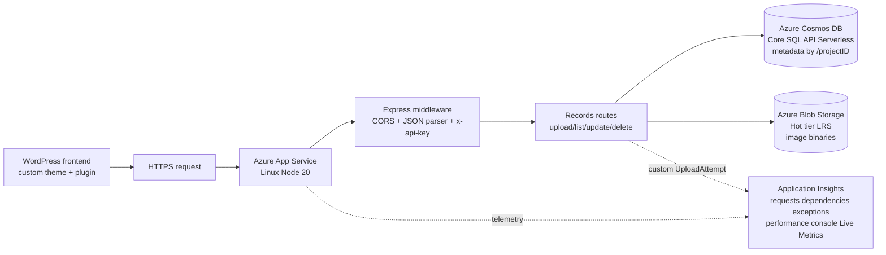

# FieldSight API

FieldSight is a biodiversity observation platform for collecting structured field records with image evidence. It is designed for researchers and field teams who need a reliable way to submit, store, and review observations from the field.

This repository contains the decoupled Express.js REST backend used by a WordPress custom theme and plugin. The API validates observation metadata, stores image binaries in Azure Blob Storage, persists searchable records in Azure Cosmos DB, and exposes authenticated endpoints for upload, listing, update, and deletion.

Built on Azure App Service, Cosmos DB Serverless, Blob Storage, and Application Insights, the backend keeps product concerns separate from infrastructure concerns while remaining small enough to operate cost-consciously.

## System Snapshot

| Layer | Implementation |
| --- | --- |
| Frontend consumer | WordPress custom theme and plugin |
| Backend runtime | Azure App Service for Linux, Node 20 runtime, B1 plan |
| API framework | Express.js |
| Metadata store | Azure Cosmos DB Core SQL API, Serverless billing |
| Partition key | `/projectID` |
| Binary storage | Azure Blob Storage, Hot tier, LRS |
| Authentication | `x-api-key` header backed by `FIELD_SIGHT_API_KEY` |
| Observability | Azure Application Insights |
| Delivery | GitHub Actions to Azure App Service via Kudu ZipDeploy |

## Overview

FieldSight API is the backend service for a biodiversity field-record collection workflow. A WordPress frontend submits image payloads and observation metadata to this API; the backend stores binary image content in Azure Blob Storage and persists the searchable metadata in Azure Cosmos DB.

This repository contains only the Express.js backend. The WordPress frontend, Azure resource definitions, and operational dashboards live outside this repo, but the API is designed to operate as a small production cloud service rather than a local-only demo.

The service focuses on a narrow operational surface:

- Receive authenticated uploads from a trusted frontend integration.
- Validate project, researcher, category, pagination, and file payload inputs.
- Store binary media separately from queryable metadata.
- Expose CRUD-style endpoints for record listing, update, and deletion.
- Emit request, dependency, exception, performance, console, and custom upload telemetry.

## Architecture Overview

The system is intentionally layered so the Express process remains stateless. App Service hosts the Node runtime and request pipeline, while Cosmos DB and Blob Storage own persistent state.

- **Client layer**: WordPress custom theme/plugin sends HTTPS requests to the API.
- **Runtime layer**: Azure App Service runs the Node 20 Express application on Linux.
- **Middleware layer**: CORS, JSON body parsing, and `x-api-key` authentication run before protected routes.
- **Route layer**: `routes/records.js` implements upload, list, update, and delete behavior with explicit async `try/catch` forwarding.
- **Service layer**: Cosmos DB stores metadata; Blob Storage stores image binaries.
- **Observability layer**: Application Insights collects platform and application telemetry when configured.

Cosmos DB uses `/projectID` as the partition key, matching the project-scoped access pattern used by reads, deletes, and partition-aware updates. Blob Storage keeps large binary payloads out of Cosmos DB, reducing document size and keeping metadata queries focused.

## System Diagram



## Folder Structure

```text
fieldsight-api/
  server.js
  config/
    env.js
  middleware/
    auth.js
    errorHandler.js
  routes/
    records.js
  services/
    blobService.js
    cosmosService.js
  .github/
    workflows/
      main_fieldsight-api.yml
  .env.example
  package.json
  package-lock.json
```

## API Endpoints

Protected endpoints require:

```text
x-api-key: <FIELD_SIGHT_API_KEY>
```

Valid record categories are:

```text
Flora, Fauna, Fungi, Habitat
```

| Method | Path | Auth | Purpose | Success |
| --- | --- | --- | --- | --- |
| `GET` | `/` | Public | Service identity/status response | `200 OK` |
| `GET` | `/health` | Public | Lightweight health probe | `200 OK` |
| `POST` | `/upload` | Required | Store image content and metadata | `201 Created` |
| `GET` | `/records` | Required | List records with optional filters and pagination | `200 OK` |
| `PUT` | `/records/:id` | Required | Update `category`, `projectID`, or both | `200 OK` |
| `DELETE` | `/records/:id` | Required | Delete a record and its blob | `200 OK` |

### `POST /upload`

Uploads base64-encoded file content to Blob Storage and writes the record metadata to Cosmos DB.

```bash
curl -X POST http://localhost:3000/upload \
  -H "Content-Type: application/json" \
  -H "x-api-key: $FIELD_SIGHT_API_KEY" \
  -d '{
    "projectID": "project-001",
    "category": "Flora",
    "researcherID": "researcher-123",
    "captureTimestamp": "2026-05-07T10:30:00Z",
    "fileName": "sample.jpg",
    "fileContent": "<base64-content>"
  }'
```

Response: `201 Created`

```json
{
  "success": true,
  "data": {
    "id": "uuid",
    "projectID": "project-001",
    "category": "Flora",
    "researcherID": "researcher-123",
    "captureTimestamp": "2026-05-07T10:30:00Z",
    "file": {
      "name": "sample.jpg",
      "blobUrl": "https://..."
    }
  }
}
```

### `GET /records`

Returns records from Cosmos DB with optional filters and pagination.

Supported query parameters:

| Parameter | Description |
| --- | --- |
| `projectID` | Filter records by project |
| `category` | Filter by one of `Flora`, `Fauna`, `Fungi`, `Habitat` |
| `researcherID` | Filter records by researcher |
| `limit` | Page size, integer from `1` to `100`; default `20` |
| `offset` | Page offset, integer `0` or greater; default `0` |

```bash
curl "http://localhost:3000/records?projectID=project-001&category=Flora&limit=20&offset=0" \
  -H "x-api-key: $FIELD_SIGHT_API_KEY"
```

Response: `200 OK`

```json
{
  "success": true,
  "total": 1,
  "count": 1,
  "limit": 20,
  "offset": 0,
  "data": [
    {
      "id": "uuid",
      "projectID": "project-001",
      "category": "Flora",
      "researcherID": "researcher-123",
      "captureTimestamp": "2026-05-07T10:30:00Z",
      "file": {
        "name": "sample.jpg",
        "blobUrl": "https://..."
      }
    }
  ]
}
```

### `PUT /records/:id`

Updates a record after checking researcher ownership. `category` and `projectID` are mutable; `researcherID` is required to authorize the update. If `projectID` changes, the service writes the document to the new Cosmos partition and removes the old item.

```bash
curl -X PUT http://localhost:3000/records/<id> \
  -H "Content-Type: application/json" \
  -H "x-api-key: $FIELD_SIGHT_API_KEY" \
  -d '{
    "researcherID": "researcher-123",
    "category": "Habitat",
    "projectID": "project-002"
  }'
```

Response: `200 OK`

### `DELETE /records/:id`

Deletes the blob and matching Cosmos DB document after checking researcher ownership. `projectID` is required because Cosmos DB uses it as the partition key.

```bash
curl -X DELETE http://localhost:3000/records/<id> \
  -H "Content-Type: application/json" \
  -H "x-api-key: $FIELD_SIGHT_API_KEY" \
  -d '{
    "projectID": "project-001",
    "researcherID": "researcher-123"
  }'
```

Response: `200 OK`

```json
{
  "success": true,
  "message": "Record deleted"
}
```

## Error Model

All route handlers use explicit async `try/catch` blocks and forward failures to centralized error middleware with `next(error)`. Operational failures are represented with `AppError`; unexpected failures are logged and returned as sanitized server errors.

Error responses use a stable JSON envelope:

```json
{
  "error": {
    "code": "ERROR_CODE",
    "message": "Human-readable message"
  }
}
```

| Status | Meaning |
| --- | --- |
| `400 Bad Request` | Invalid body shape, missing required fields, invalid category, unsupported update fields, or invalid query pagination |
| `401 Unauthorized` | Missing or invalid `x-api-key` |
| `403 Forbidden` | Researcher ownership check failed |
| `404 Not Found` | Record or route does not exist |
| `413 Payload Too Large` | JSON body or decoded file content exceeds configured limits |
| `500 Internal Server Error` | Unexpected failure; response is sanitized while details are logged and tracked |

## Security Model

Secrets and service credentials are read from environment variables or Azure App Service App Settings. API keys, Cosmos keys, storage connection strings, and Application Insights connection strings are not hardcoded in source.

- Protected routes require the `x-api-key` header.
- `FIELD_SIGHT_API_KEY` is loaded from the environment at startup.
- API key comparison hashes both values and uses `crypto.timingSafeEqual`.
- CORS is controlled through `CORS_ORIGIN`; production should restrict it to the WordPress origin.
- HTTPS is enforced at the Azure/App Service edge.
- Request body size is constrained by `JSON_BODY_LIMIT`; decoded upload size is constrained by `MAX_UPLOAD_BYTES`.

Azure AD, Managed Identity, and Azure RBAC are intentionally not claimed as current features. They are listed in the roadmap as the next stronger identity and secret-management posture.

## Observability

Application Insights is enabled when `APPLICATIONINSIGHTS_CONNECTION_STRING` is present. Without that setting, the API continues to run and logs that telemetry is not configured.

Configured telemetry includes:

- HTTP request collection.
- Dependency collection for Azure SDK calls.
- Exception collection.
- Performance telemetry.
- Console log collection.
- Live Metrics.
- Cloud role tagging as `fieldsight-api`.

The API also emits application-level telemetry:

- `UploadAttempt` custom event with `projectID` and `category`.
- Exception telemetry from centralized error middleware with method, route/path, status code, error code, and operational-error flag.

## Scalability & Cost Considerations

The deployment is sized for a cost-conscious production footprint while preserving clean separation between compute, metadata, and binary storage.

- **App Service B1** keeps the API simple to operate and affordable. The Express app is stateless, so scaling to a larger App Service plan is straightforward if traffic increases, but autoscale is not part of the current implementation.
- **Cosmos DB Serverless** bills by consumed request units, which fits variable or low-to-moderate traffic better than always-on provisioned throughput.
- **`/projectID` partitioning** aligns storage layout with project-scoped access patterns and keeps deletes and partition-aware reads efficient.
- **Blob Storage Hot tier with LRS** is appropriate for actively accessed image content with a simple regional durability model.
- **Base64 uploads** simplify WordPress integration but increase payload size compared with multipart upload or direct-to-Blob flows.

For sustained high traffic, the likely next moves are App Service plan sizing, direct-to-Blob upload patterns, Cosmos throughput review, and stronger request throttling.

## CI/CD Pipeline

The repository deploys through GitHub Actions using `.github/workflows/main_fieldsight-api.yml`.

Pipeline behavior:

1. Checks out the repository.
2. Sets up the CI Node runtime configured in the workflow as `22.x`.
3. Runs `npm ci`.
4. Runs `npm run build --if-present`.
5. Runs `npm test --if-present`.
6. Creates a deterministic zip package from the repository contents, excluding `.github`.
7. Uploads the package as a workflow artifact.
8. Deploys the zip to Azure App Service through Kudu ZipDeploy.

Production is documented as Azure App Service Linux on Node 20. The workflow CI runtime is separate from the production runtime and should be kept compatible with the deployed Node version.

## Tradeoffs

- **API key authentication** is lightweight and appropriate for a controlled WordPress-to-backend integration, but it is not a complete user identity or authorization model.
- **Connection strings and account keys** are straightforward for a small deployment, but Managed Identity would reduce long-lived secret handling.
- **Base64 file transfer** is easy to submit from WordPress JSON workflows, but it is less bandwidth-efficient than multipart uploads or direct-to-Blob upload sessions.
- **Cosmos DB Serverless** minimizes baseline cost for variable traffic, while provisioned throughput can be more predictable for steady high-volume workloads.
- **App Service B1** provides a practical production baseline, but higher tiers are better suited for autoscale, stronger performance isolation, and heavier sustained traffic.
- **Blob URLs in API responses** are useful for clients, but public media access policy should be designed deliberately before exposing blobs outside trusted flows.

## Roadmap

- Azure AD authentication, Managed Identity, and Azure RBAC for stronger identity and secret management.
- Direct-to-Blob or SAS-based upload flow to reduce API payload size and improve large-file handling.
- Rate limiting and request throttling for abuse resistance.
- OpenAPI contract for client generation and clearer integration testing.
- Integration tests against Azure test resources or local-compatible service emulators.
- Structured audit events and richer Application Insights dashboards.
- Optional App Service plan upgrade or autoscale configuration if traffic patterns justify it.

## Local Development

```bash
npm install
cp .env.example .env
npm test
npm start
```

Local startup requires Azure-compatible configuration because the app initializes Cosmos DB and Blob Storage on boot.

Required environment variables:

```text
NODE_ENV=development
PORT=3000
CORS_ORIGIN=http://localhost:8080
FIELD_SIGHT_API_KEY=<long-random-api-key>
JSON_BODY_LIMIT=15mb
MAX_UPLOAD_BYTES=10485760
COSMOS_ENDPOINT=<cosmos-core-sql-endpoint>
COSMOS_KEY=<cosmos-key>
COSMOS_DATABASE_ID=fieldsightdb
COSMOS_CONTAINER_ID=images
COSMOS_PARTITION_KEY=/projectID
AZURE_STORAGE_CONNECTION_STRING=<storage-connection-string>
AZURE_STORAGE_CONTAINER_NAME=imagestore
```

Optional telemetry:

```text
APPLICATIONINSIGHTS_CONNECTION_STRING=<application-insights-connection-string>
```

Health check:

```bash
curl http://localhost:3000/health
```

## Production Notes

- Restrict `CORS_ORIGIN` to the deployed WordPress origin.
- Keep HTTPS enforced at the Azure edge.
- Store all secrets in Azure App Service App Settings or GitHub Actions Secrets.
- Rotate `FIELD_SIGHT_API_KEY`, `COSMOS_KEY`, and storage account credentials on a regular schedule.
- Keep Blob Storage private unless a public media delivery model is intentionally designed.
- Monitor 4xx and 5xx rates, Azure dependency failures, upload volume, payload rejections, and Cosmos request-unit consumption.
- Review App Service CPU, memory, and response time before moving beyond the B1 plan.
- Keep this README aligned with the actual API contract whenever route behavior changes.
